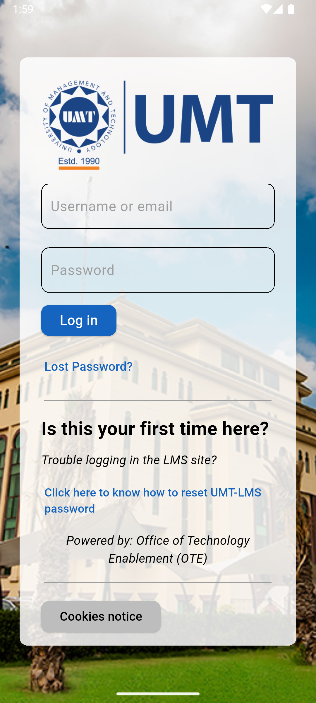

# Flutter LMS Login Page UI

A clean and simple LMS (Learning Management System) login page UI built using Flutter. This project focuses on layout design, styling, and responsive elements. Currently, this is a UI-only implementation with no backend or authentication logic.

## ✨ Features
- Custom background image
- TextFields for username/email and password
- Styled login button
- Help and reset password links
- Informational sections and dividers
- Fully designed in Flutter using Material components

## 📸 Screenshots
### **Login Page**

##  Tech Stack 🛠️
- **Flutter**: UI toolkit for building natively compiled applications.
- **Dart**: The language used to develop Flutter apps.
- **VS Code / Android Studio**: Development environments.
- **Git**: Version control for source code.